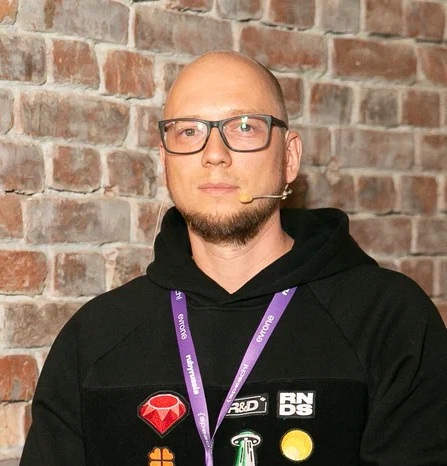

### Hello / Привет 👋

My name is Yuri. I'am a lead developer and technical writer @ [RND-SOFT](https://github.com/RND-SOFT) (Agredator) 
Меня зовут Юрий. Я ведущий разработчик и технический писатель @ [RND-SOFT](https://github.com/RND-SOFT) (Agredator)

I'am closely working with Ruby and other related technologies and blogging to https://blog.rnds.pro  
Я плотно работаю с Ruby и прочими связанными технологиями и пишу в блог https://blog.rnds.pro

 ### Ask me about / Спрашивайте меня о 💬  

* Ruby, Rails, GoLang and AI ...
* Event Based Architecture, Message Processing, Microservices ...
* Distributed Systems, Asynchronous World, Shit Happens ...
* Consul, Traefik, Docker, RabbitMQ, Prometheus, ELK ...
* Linux, Gentoo ...

### How to reach me / Контакты 📫 

MAX: [Юрий](https://max.ru/u/f9LHodD0cOJUM1tltjdTMJf57shVhouUvORcKn-Cg2hCA6Dl72HDlIIvs-g) - в MAX
Telegram: [@jerry_ru](https://t.me/jerry_ru) - Всегда на связи  
Telegram Channel: [architdev](https://t.me/architdev) - Мой канальчик  
Teletype: [jerry_ru](https://teletype.in/@jerry_ru) - blogging experiments  
Dev.to: [kinnalru](https://dev.to/kinnalru) - some technical account  

<!--
**kinnalru/kinnalru** is a ✨ _special_ ✨ repository because its `README.md` (this file) appears on your GitHub profile.

Here are some ideas to get you started:

- 🔭 I’m currently working on ...
- 🌱 I’m currently learning ...
- 👯 I’m looking to collaborate on ...
- 🤔 I’m looking for help with ...
- 💬 Ask me about ...
- 📫 How to reach me: ...
- 😄 Pronouns: ...
- ⚡ Fun fact: ...
-->

